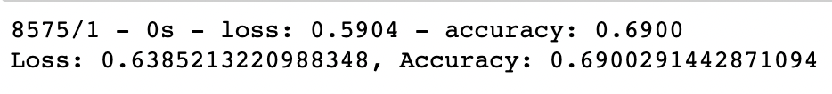
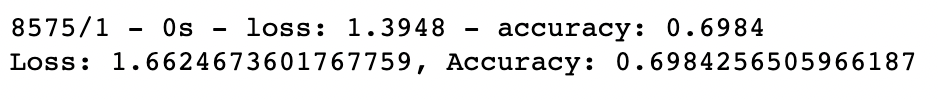

# Neural_Network_Charity_Analysis
## Overview
The purpose of this analysis was to use machine learning and neural networks to define features fand create a binary classifier that is capable of predicting whether applicants will be successful if funded by Alphabet Soup. Alphabet Soup is a business that sends funding to smaller organizations to help them become successful.

## Results

Data Preprocessing:
* The only variable considered a target for my model is the “IS_SUCCESSFUL” variable because I wanted to see how all the other variables can contribute towards predicting whether applicants will be successful as features.
* There were 2 variables in the dataset that were removed and were therefore neither used as targets nor features and they were “EIN” and “NAME” variables.

Compiling, Training, and Evaluating the Model
* Originally when completing my neural network model I used 110 hidden layers and an output layer and received an accuracy of 69% as shown below

*In an attempt to achieve better target model performance I decided to change the number of layers used. I increased the layers and decreased them and I only achieved accuracy slightly better than when I ran the model originally when I ran the model with 10 hidden layers and achieved an accuracy of approximately 70% (69.8 %) as shown below

## Summary
Overall I was able to create a neural network model that was able to predict whether a business that receives funding from Alphabet Soup will be successful with approximately 70 percent accuracy. 
